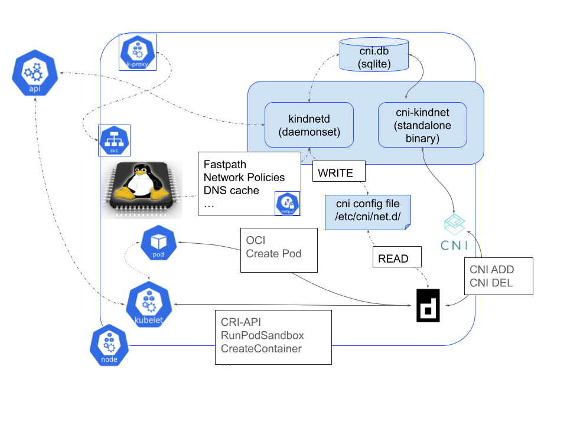

Kindnet is a simple yet powerful Kubernetes Network Plugin designed for performance, scalability, and low resource consumption. It provides essential networking capabilities for Kubernetes Pods, including IP address management (IPAM), network policy enforcement, DNS caching, NAT64, and more.

## Architecture

Kindnet follows a node-centric architecture, with a dedicated agent running on each Kubernetes node. This agent is responsible for:

* Pod Networking: Creating and configuring network interfaces for Pods.
* IPAM: Allocating and managing IP addresses for Pods.
* Network Policies: Enforcing network access controls between Pods.
* DNS Caching: Providing a local DNS cache for faster name resolution.
* NAT64: Enabling IPv6 connectivity for Pods in IPv4 environments.
* Other Network Features: Supporting additional networking functionalities as needed.

## Design Principles

* Performance: Kindnet is optimized for high throughput and low latency, ensuring minimal overhead for Pod networking.
* Low Resource Consumption: The agent is designed to have a small memory and CPU footprint, minimizing resource usage on the node.
* Scalability: Each node agent operates independently, avoiding shared state and centralized dependencies that can hinder scalability.
* Technology Agnostic: Kindnet leverages the best tools for each task, integrating with existing components and avoiding unnecessary reinvention.

## Key Components

* Node Agent: A lightweight daemon running on each Kubernetes node, responsible for core networking functions.
* [CNI Plugin](../cni/index.md): A simple binary that interfaces with the node agent to configure Pod networking during container creation and deletion.
* IPAM controller: use the existing controller in the kube- or cloud-controller-manager or the [kubernetes-sigs/node-ipam-controller](https://github.com/kubernetes-sigs/node-ipam-controller)
