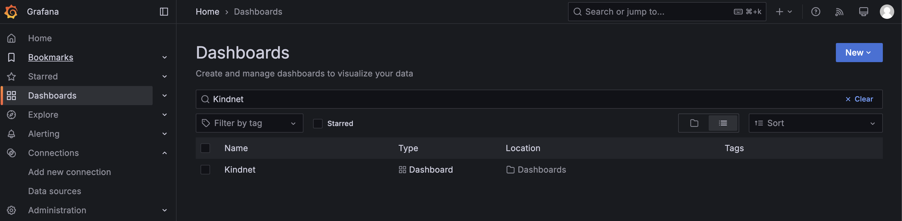
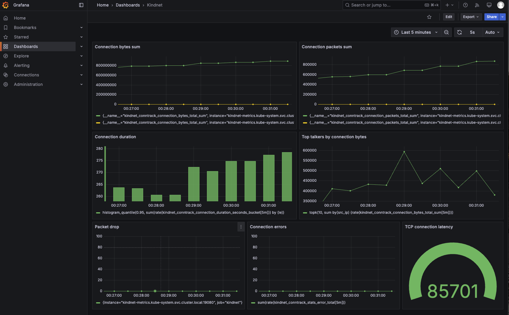

In this tutorial, we will guide you through the process of setting up a Grafana dashboard to visualize metrics collected by kindnet, a CNI (Container Network Interface) plugin for Kubernetes. By the end of this tutorial, you will have a fully functional monitoring setup that includes Prometheus for metric collection and Grafana for visualization.

## Prerequisites

Before you begin, ensure you have the following tools installed on your local machine:
- **Docker Desktop**: Required to run Kubernetes clusters locally.
- **kind**: A tool for running local Kubernetes clusters using Docker container nodes. You can install it by following the instructions on the [kind website](https://kind.sigs.k8s.io).

## Steps

**1. Create `kind` cluster [without CNI](multi-node-k8s-no-cni.yaml)**

```bash
kind create cluster --config multi-node-k8s-no-cni.yaml --name home-lab
```

**2. [Configure kindnet CNI](kindnet-custom-resources.yaml)**

```bash
kubectl apply -f kindnet-custom-resources.yaml
```

**3. Set Up [namespace for monitoring](monitoring-namespace.yaml) and config map with [`Grafana` dashboard, which uses `kindnet` metrics](kindnet-dashboard.json)**

```bash
kubectl apply -f monitoring-namespace.yaml
kubectl create configmap kindnet-dashboards --from-file=kindnet-dashboard.json -n monitoring
kubectl label configmap kindnet-dashboards grafana_dashboard=1 -n monitoring
```

**4. Install and configure `Grafana` and `Prometheus`**

```bash
helm repo add prometheus-community https://prometheus-community.github.io/helm-charts
helm repo add grafana https://grafana.github.io/helm-charts
helm repo update
helm install monitoring prometheus-community/kube-prometheus-stack --namespace monitoring --values grafana-prometheus-kindnet-scrape-config.yaml
```

**5. Retrieve Grafana `admin` password**

```bash
kubectl get secrets --namespace monitoring monitoring-grafana -o jsonpath="{.data.admin-password}" | base64 -d ; echo
```

**6. Forward port for `Grafana`**

```bash
kubectl port-forward --namespace monitoring svc/monitoring-grafana 3000:80
```

**7. Access `Grafana` dashboard**

Open your browser and go to [http://localhost:3000](http://localhost:3000). Log in with the admin credentials retrieved in the previous step.

Navigate to the `Dashboards` section:



Select the `kindnet` dashboard to view the metrics:


