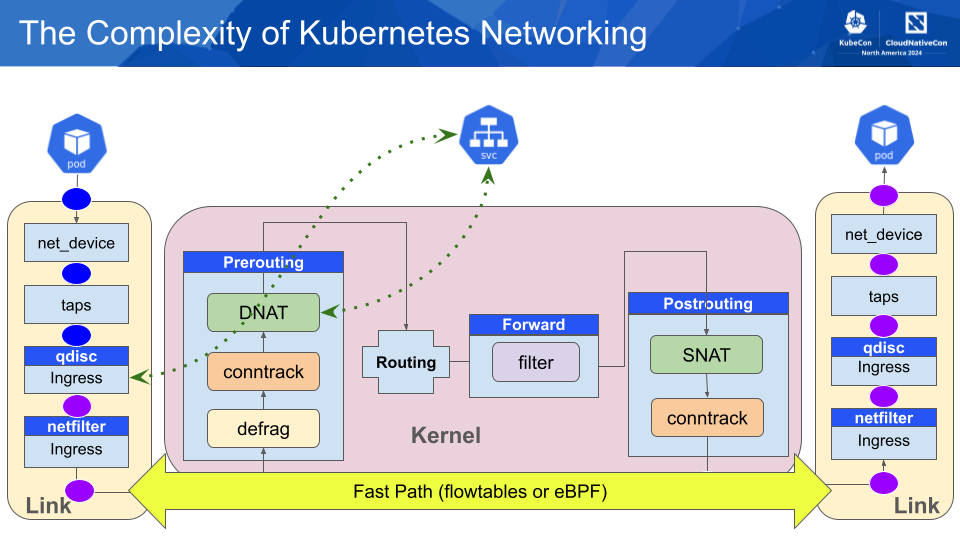

Kindnet offers a fastpath feature to significantly boost network performance. This feature leverages the kernel's flowtable architecture to offload network traffic processing, reducing latency and increasing throughput.


### What is Fastpath?

Fastpath is a mechanism that bypasses the normal Kubernetes networking path for specific network flows. By identifying and offloading these flows to the kernel's flowtable, Kindnet reduces the overhead associated with processing each packet individually.

The kernel [Netfilter’s flowtable infrastructure](https://docs.kernel.org/networking/nf_flowtable.html) allows to define a fastpath through the flowtable datapath. This infrastructure also provides hardware offload support.

```
                                       userspace process
                                        ^              |
                                        |              |
                                   _____|____     ____\/___
                                  /          \   /         \
                                  |   input   |  |  output  |
                                  \__________/   \_________/
                                       ^               |
                                       |               |
    _________      __________      ---------     _____\/_____
   /         \    /          \     |Routing |   /            \
-->  ingress  ---> prerouting ---> |decision|   | postrouting |--> neigh_xmit
   \_________/    \__________/     ----------   \____________/          ^
     |      ^                          |               ^                |
 flowtable  |                     ____\/___            |                |
     |      |                    /         \           |                |
  __\/___   |                    | forward |------------                |
  |-----|   |                    \_________/                            |
  |-----|   |                 'flow offload' rule                       |
  |-----|   |                   adds entry to                           |
  |_____|   |                     flowtable                             |
     |      |                                                           |
    / \     |                                                           |
   /hit\_no_|                                                           |
   \ ? /                                                                |
    \ /                                                                 |
     |__yes_________________fastpath bypass ____________________________|
             Fig.1 Netfilter hooks and flowtable interactions
```

### How it Works

Kindnet monitors network traffic patterns. When it detects a connection with more than a certain number of packets (the threshold), it automatically offloads that flow to the fastpath.  The default threshold is 20 packets, designed to optimize performance by avoiding the overhead of offloading short-lived flows.



Users can define the threshold via the flag `--fastpath-threshold`, or completely disable the feature by setting the threshold to 0.

```yaml
      containers:
      - args:
        - /bin/kindnetd
        - --hostname-override=$(NODE_NAME)
        - --fastpath-threshold=6
        - --v=2
```

### Performance Improvements

Bypassing the Kernel stack has some important performance improvements, not only on the throughput available but also on the resource consumption of the host.

As an example, running a simple `iperf` test on a `kind` cluster 

```sh
$ kubectl run client --image=registry.k8s.io/e2e-test-images/agnhost:2.53
$ kubectl run server --image=registry.k8s.io/e2e-test-images/agnhost:2.53
```

Without `fastpath`:

```
$ kubectl exec -it client -- iperf -c 10.244.1.32
------------------------------------------------------------
Client connecting to 10.244.1.32, TCP port 5001
TCP window size: 16.0 KByte (default)
------------------------------------------------------------
[  1] local 10.244.2.93 port 55398 connected with 10.244.1.32 port 5001
[ ID] Interval       Transfer     Bandwidth
[  1] 0.00-10.01 sec  37.5 GBytes  32.1 Gbits/sec
```

Enabling `fastpath` shows a considerable improvement, from 32.1 Gbps to 38.1 Gbps:

```sh
$ kubectl exec -it client -- iperf -c 10.244.1.32            
------------------------------------------------------------
Client connecting to 10.244.1.32, TCP port 5001
TCP window size: 16.0 KByte (default)
------------------------------------------------------------
[  1] local 10.244.2.93 port 42212 connected with 10.244.1.32 port 5001
[ ID] Interval       Transfer     Bandwidth
[  1] 0.00-10.00 sec  44.4 GBytes  38.1 Gbits/sec

```


### Troubleshooting

Kindnet uses nftables to enable the faspath, if the feature is not working well or misbehaving users can find the configuration in the corresponding nftables table `kindnet-fastpath`:

```sh
$ nft list table inet kindnet-fastpath
table inet kindnet-fastpath {
        comment "rules for kindnet fastpath"
        flowtable kindnet-flowtables {
                hook ingress priority filter
                devices = { eth0, knet379d0a5f, knetabb40db0 }
        }

        chain kindnet-fastpath-chain {
                type filter hook forward priority -110; policy accept;
                ct packets > 20 flow add @kindnet-flowtables counter packets 1 bytes 7292
        }
}
```

The `flowtable` must contain the list of interfaces on the Node, only the interfaces present on that `devices` list of that table will be able to use the fastpath.

The chain `kindnet-fastpath-chain` has a counter with the number of packets and bytes that are offloaded, if this counter does not increase means no connections are being accelerated.

